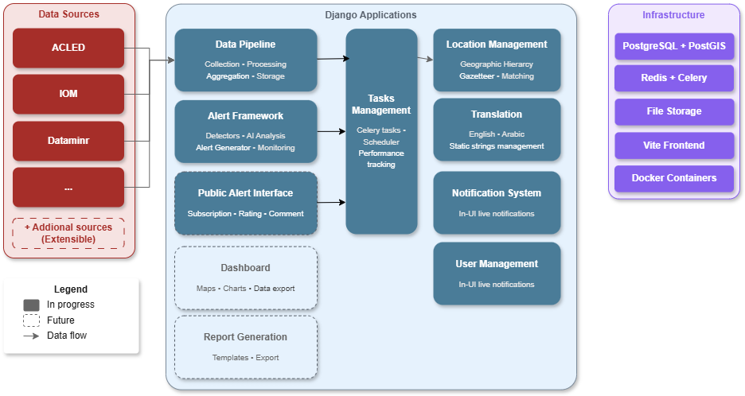

# Technical Specifications: NRC Early Warning and Alert System for Sudan

## Versions

| **Date** | **Author** | **Changes** |
| --- | --- | --- |
| 2025-07-23 | PM | Initial version for data pipeline, task engine, location and translation |
| 2025-09-01 | Claude | Updated Alert System API endpoints with external integration capabilities |
| 2025-09-19 | Claude | Added Notification System and User Management specifications |

## Table of Contents
[TOC]

## Overall architecture
The NRC Early Warning and Alert System (EWAS) for Sudan is a comprehensive Django-based platform designed to collect, process, and analyze humanitarian and conflict data from multiple sources to provide early warning alerts for emergency response.

<figure>
<figcaption>Overall system architecture</figcaption>

</figure>

### Backend
The project is developed in Python with a PostgreSQL backend (with PostGIS extension). It is contained within a Django project, with applications that fulfill different purposes and can be deployed separately.

Background tasks are managed with Celery and Redis, and scheduled with django-celerybeat. An application is dedicated to managing scheduled tasks and displaying execution data and statistics.

### Frontend(s)
The frontend is developed in Bootstrap, SCSS, vanilla JS (no framework) and packaged with Vite.js. Each Django application will have a small number of administration pages, so that they are fully standalone applications.

A common frontend application will be developed, that will access various applications APIs, so these will need to be developed. We use NPM to manage package. No call to external CDNs is made.

### Core principles
1.	**Modular Architecture:** Each Django application is self-contained and can be deployed independently
2.	**API-First Design:** All functionality exposed via RESTful APIs for integration flexibility
3.	**Asynchronous Processing:** Long-running data operations handled by Celery task queues
4.	**Multilingual Support:** Built-in English/Arabic translation throughout the system
5.	**Geographic Intelligence:** Location matching and spatial data support
6.	**Extensibility:** Plugin architecture for adding new data sources and processing logic

### Technology stack
| **Layer** | **Technology** | **Purpose** |
| --- | --- | --- |
| **Backend** | Django 5.2 + Python 3.12 | Web framework and business logic |
| **Database** | PostgreSQL 14+ with PostGIS | Relational data with geographic support |
| **Task Queue** | Celery + Redis | Background processing and scheduling |
| **Frontend** | Bootstrap 5 + Vite.js | Modern responsive web interface |
| **Translation** | django-modeltranslation | Multi-language data and UI support |
| **Monitoring** | Custom Django app | Task execution and performance tracking |
| **Dependencies** | uv package manager | Fast Python dependency management |

### Translation
The application will work in English and Arabic. All applications will make use of [django-modeltranslation](https://django-modeltranslation.readthedocs.io/en/latest/) library to translate relevant fields in the database. An already developed translation component will be used to translate all static strings in the application from a single database table.

[1. Data pipeline](1.-Data-pipeline.md)
[2. Alert framework](2.-Alert-framework.md)
[3. Dashboard](3.-Dashboard.md)
[4. Report generation](4.-Report-genertion.md)
[5. Workflow engine](5.-Workflow-engine.md)
[6. Public alert interface](6.-Public-alert-interface.md)
[7. Task engine](7.-Task-engine.md)
[8. Location framework](8.-Location-framework.md)
[9. Translation system](9.-Translation-system.md)
[10. LLM query service](10.-LLM-query-service.md)
[11. Notification system](11.-Notification-system.md)
[12. Users management](12.-Users-management.md)
