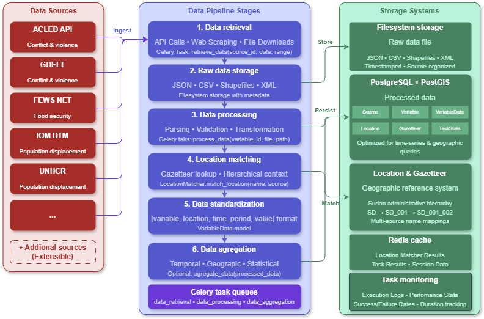
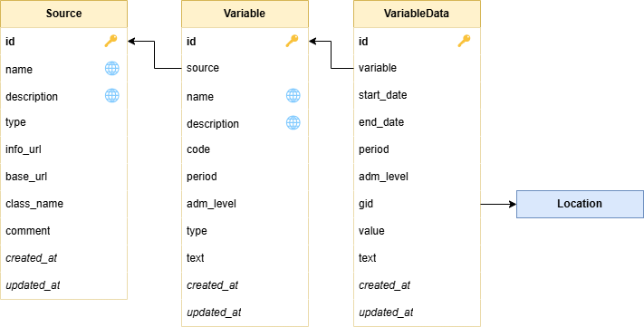
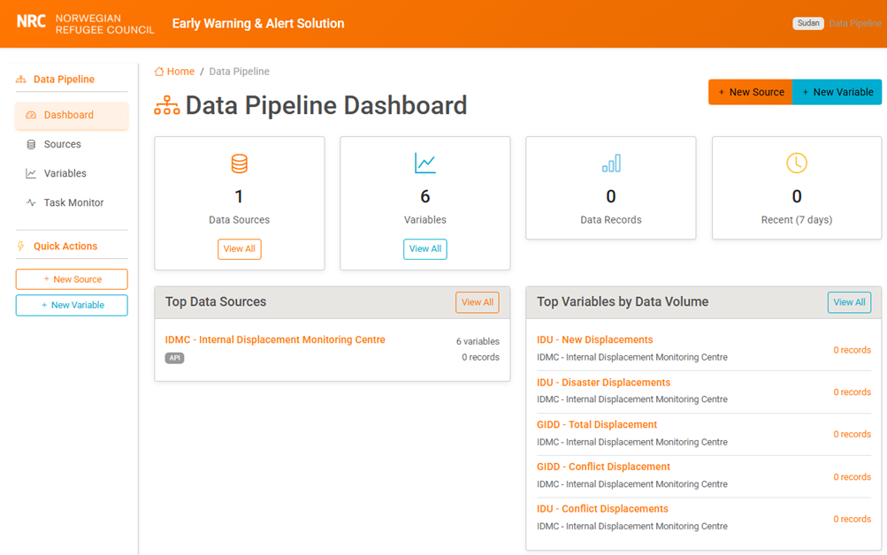
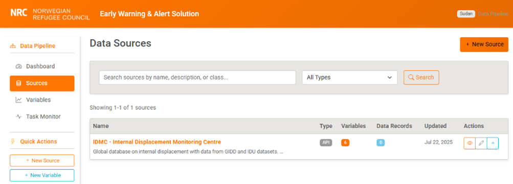
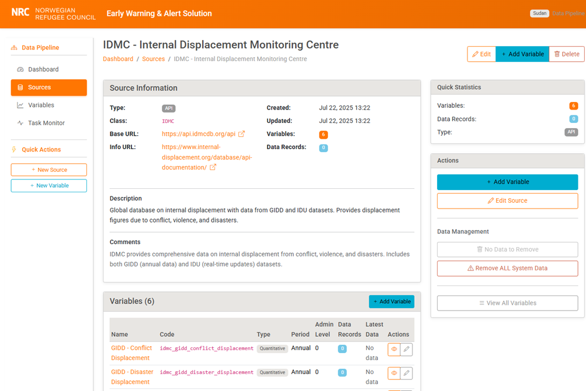

## 1. Data retrieval and processing pipeline
The data pipeline application provides third-party data collection and processing capabilities. It provides a unified framework for retrieving, processing, standardizing, and serving data from multiple external sources.

The pipeline periodically retrieves data from multiple sources (APIs, web crawling and file uploads); it stores the raw data on the filesystem; it processes it into a standardized format and stores it in the database; and when needed, it aggregates it at various levels (temporal, geographic).

The final objective of this data pipeline is to analyze the data to trigger early warning notifications for emergency response.

### 1.1. Key concepts

#### Data sources
**Data sources** represent the external providers that supply raw information to the system. These can be classic API endpoints, web download, simple file uploads or possibly other methods. The system was designed to be provider-agnostic, meaning it can accommodate virtually any external data provider through its plugin architecture.

Each data source is characterized by its access method, which determines how the system connects to and retrieves data. API-based sources are the most common, offering real-time access to structured data through RESTful endpoints. Web scraping sources handle websites that don't provide APIs but contain valuable tabular data. File upload sources accommodate Excel spreadsheets, CSV files, and other documents that are manually provided. FTP sources connect to legacy systems that still use file transfer protocols, while database sources can directly query remote databases when API access isn't available.

The system maintains comprehensive metadata for each source, including authentication credentials, base URLs, and Python class references that define the specific implementation logic. This approach allows new data sources to be added without modifying the core system architecture, simply by implementing the required interface methods.

**_Examples:_**

* IDMC (Internal Displacement Monitoring Centre): 2 API endpoints (GIDD, IDU)
* *ACLED (Armed Conflict Location & Event Data Project): 2 API endpoints
* *FEWS.NET (Famine Early Warning System): Retrieval of zipped shapefiles

#### Variables

**Variables** represent specific metrics, indicators, or data points that sources can provide. A single source like IDMC might provide multiple variables: conflict-induced displacement, disaster-induced displacement, total displacement figures, and refugee population counts.

Each variable is characterized by its temporal granularity, which defines how frequently the data is updated or measured. Some variables are event-based, meaning they represent specific occurrences like displacement events that happen on particular dates. Others follow regular temporal patterns - daily refugee counts, weekly fatality summaries, or annual population estimates. This temporal classification is crucial for proper data aggregation and analysis.

Variables also have geographic scope, defined by administrative levels that range from country-level (level 0) down to local community level (level 5). This hierarchical approach ensures that data can be properly aggregated and compared across different geographic scales. The data type classification - quantitative, qualitative, textual, or categorical - determines how the system processes and validates the incoming data.

The system enforces unique constraints to ensure that each variable code is unique within its source, preventing confusion and data conflicts. Variable codes are automatically normalized to follow consistent naming conventions, using lowercase letters and underscores to create technically valid identifiers.

**_Examples:_**
* idmc_gidd_conflict_displacement`: Conflict-induced displacement from IDMC
* `acled_fatalities`: Fatality counts from ACLED conflict events
* `unhcr_refugee_population`: Refugee population statistics

#### Variable Data

**Variable data** represents the actual processed and standardized information stored in the system. This is where raw external data becomes usable information that can be queried, analyzed, and visualized. Each data record is temporally bounded with start and end dates, allowing the system to handle both point-in-time measurements and period-based aggregations.

The geographic linking system connects each data record to the hierarchical location system (see section [8 Location framework](8.-Location-framework) below), ensuring that all data can be properly mapped and spatially analyzed.

The value storage system accommodates both numeric measurements and textual descriptions within the same framework.

Provenance tracking ensures that every data record maintains a clear connection back to its source variable and creation metadata.

#### Data Pipeline Workflow
The data pipeline workflow represents the systematic transformation process that converts raw external data into standardized, analysis-ready information. This process follows five distinct phases, each with specific responsibilities and quality controls.

1.	The retrieval phase focuses on acquiring raw data from external sources using the appropriate access method. During this phase, the system handles authentication, rate limiting, error recovery, and raw data preservation. All retrieved data is stored in timestamped files, creating a permanent archive that supports data lineage tracking and reprocessing capabilities.

2.	The processing phase transforms raw data into the system's standardized format. This involves parsing format-specific data structures (JSON, CSV, XML), validating data quality, resolving geographic names to standard locations, normalizing temporal information, and performing unit conversions. The processing logic is specific to each data source, implemented through the plugin architecture.

3.	The storage phase creates the final standardized records in the database. This includes deduplication logic to prevent the same information from being stored multiple times, referential integrity checks to ensure all foreign key relationships are valid, and final validation to confirm that stored data meets quality standards.

4.	The optional aggregation phase creates derived statistics and summaries. This might involve temporal aggregation (converting daily data to weekly summaries) or geographic aggregation (combining district-level data into state-level totals). These aggregations are particularly valuable for dashboard displays and high-level analysis.

5.	The access phase makes processed data available through both the web interface and API endpoints. This includes query optimization to ensure fast response times, caching of frequently accessed data, and format conversion to support different client needs.

### 1.2. Architecture

<figure>
<figcaption>Data pipeline architecture</figcaption>

</figure>


#### Data source plugins
The plugin architecture enables extensibility without core system modifications. Each data source and variable will require specific retrieval, processing and aggregation methods. These are implemented in code in a standardized way, through individual data source plugins. Each plugin derives from a base source class.

The **_abstract base class_** defines a common interface that all data source implementations must follow, including methods for data retrieval (`get`) and processing (`process`), along with optional aggregation capabilities. Later on, the base class and derived classes will also integrate analysis and alert triggering functions.

The base class provides **_common functionality_** like logging, file management, and location matching, while concrete implementations provide source-specific logic. For example, the IDMC implementation knows how to authenticate with IDMC's API, parse their specific JSON response format, and extract the relevant fields for Sudan-related data.

The **_dynamic loading system_** allows new data sources to be added through configuration rather than code changes. When a source is configured in the database, the system uses Python's importlib functionality to dynamically load and instantiate the appropriate implementation class. This approach supports both development agility and operational flexibility.

**_Error handling_** within the plugin system follows a consistent pattern where source-specific exceptions are caught and converted to standardized error messages.

#### Processing pipeline
The processing pipeline uses a Pipeline pattern with Command objects to create a **flexible, reusable data transformation system**. Each processing stage is implemented as a separate command that can be executed independently, tested in isolation, and combined in different sequences depending on the data source requirements.

The **data parsing** stage handles format-specific parsing logic, converting raw API responses, CSV files, XML documents, or database result sets into Python data structures. This stage is implemented as pluggable parsers that can be selected based on the source configuration, allowing the same pipeline framework to handle diverse data formats.

**Validation** stages implement both technical validation (data type checking, format validation) and business logic validation (range checking, consistency validation). The validation system uses a rule-based approach where validation rules can be configured per variable type, allowing for flexible quality control without hardcoded business logic.

**Location matching** resolves textual location names to standardized geographic entities based on a gazetteer – a table of alternative names. The system uses exact name matching  (with or without hierarchical context), and code matching. No fuzzy matching is implemented, as experience proves that it can lead to too many false positives, in particular when location names are transliterated (as is the case in Sudan). In the case a location is unknown, the system will halt the processing and return an error. Manual matching will need to be entered into the gazetteer, and the processing can then resume. Since sources will use consistent geographic reference systems, this is expected to represent a limited manual workload, essentially at the time of integrating a new source.

**Temporal standardization** handles the complexity of converting diverse date and time representations into the system's standard format. This includes parsing multiple date formats, handling time zones, resolving ambiguous date representations, and creating proper temporal ranges for period-based data.
Value processing handles unit conversion, numeric validation, and text standardization. This stage ensures that quantitative data is expressed in consistent units and falls within reasonable ranges, while textual data is cleaned and normalized for consistent presentation.

#### Asynchronous task management
All data retrieval and processing tasks are scheduled and run by the scheduled tasks execution and monitoring system. See [section 7](8-task-engine) below.

#### Location Integration
As already mentioned above, the data pipeline integrates with the location framework component, described in [section 8](8-location-management) below

### 1.3. Data model

#### Model diagram
_Data pipeline data model_


#### Model specification
##### Source Model
**Purpose:** The Source model provides configuration and metadata for external data providers

**Key Fields:**
- `name`: Human-readable source identifier (e.g., "IDMC - Internal Displacement Monitoring Centre")
- `type`: Data access method - API, web, file, ftp, database
- `class_name`: Python class implementing source logic (e.g., "IDMC")
- `base_url`: Primary API endpoint or connection string

**Validation Rules:**
- `class_name` must be valid Python identifier starting with uppercase
- `base_url` required for API and FTP source types
- `name` must be unique across all sources

**Translation Support:** `name`, `description`, `comment` fields support multiple languages

##### Variable Model

**Purpose:** Definition of specific data metrics available from sources

**Key Fields:**
- `code`: Technical identifier, unique within source (e.g., "idmc_gidd_conflict_displacement")
- `period`: Temporal granularity - day, week, month, quarter, year, event
- `adm_level`: Geographic administrative level (0=country, 1=state, 2=district, etc.)
- `type`: Data classification - quantitative, qualitative, textual, categorical

**Business Rules:**
- Code automatically normalized to lowercase with underscores
- Period must match expected data frequency from source
- Administrative level must align with location hierarchy

**Relationships:**
- Many-to-one with Source (each variable belongs to exactly one source)
- One-to-many with VariableData (each variable can have many data records)

##### VariableData Model

**Purpose:** Standardized storage for processed data records

**Key Fields:**
- `start_date`/`end_date`: Temporal bounds for data record
- `value`: Numeric data (DecimalField with high precision)
- `text`: Textual/qualitative data
- `gid`: Link to geographic location in location.Location model

**Constraints:**
- Unique constraint prevents duplicate records for same variable-time-location
- Either value or text must be non-null (enforced in model validation)
- Date range must be valid (start_date ≤ end_date)
**Indexes:**

- Composite index on (variable, start_date, end_date) for time-series queries
- Index on gid for geographic queries
- Index on created_at for recent data queries

### 1.4. Implementation

#### Application structure
The application is designed as a stand-alone Django application. It relies on other applications within the Django project, but these can be accessed through API calls if required.

```
data_pipeline/
├── management/
│   └── commands/
│       └── run_pipeline.py          # Main pipeline execution
├── sources/
│   ├── __init__.py
│   ├── acled.py                     # ACLED implementation
│   ├── idmc.py                      # IDMC implementation
│   ├── ...                          # Other sources
│   └── README.md                    # Source documentation
├── templates/data_pipeline/
│   ├── base.html                    # Base template
│   ├── dashboard.html               # Main dashboard
│   ├── source_detail.html           # Source detail view
│   ├── variable_detail.html         # Variable detail view
│   └── ...                          # Other templates
├── templatetags/
│   └── vite_tags.py                 # Vite integration
├── migrations/                      # Database migrations
├── admin.py                         # Admin interface configuration
├── apps.py                          # App configuration
├── base_source.py                   # Abstract source class
├── forms.py                         # Form definitions
├── models.py                        # Data models
├── tasks.py                         # Celery tasks
├── translation.py                   # Translation configuration
├── urls.py                          # URL routing
├── views.py                         # View logic
└── tests/                           # Test suite
```

#### Sources

##### Abstract base class

The abstract base class implementation provides a consistent interface that all data source plugins must implement while offering common functionality that reduces duplication across source implementations. The base class handles logging configuration, file path management, location matching, and error handling patterns that are common across all data sources.

The base class exposes the following interface:
-	get(): retrieve raw data from external source
-	process(): process raw data into standardized format
-	aggregate(): Aggregate processed data to different temporal/geographic levels

In addition, the base class implements the following utility functions:
-	log_info(): log informational message
-	log_error(): log error message
-	get_raw_data_path(): get file path for storing raw data
-	validate_location_match(): gazetteer-based location matching with fallback strategies

_Source abstract base class_
```python
class Source(ABC):
    """Abstract base class for all data source implementations."""

    def __init__(self, source: 'Source'):
        self.source = source
        self.logger = self._setup_logger()

    @abstractmethod
    def get(self, variable: Variable, **kwargs) -> bool:
        """Retrieve raw data from external source.

        Must be implemented by each source class.
        Should save raw data to filesystem and return success status.
        """
        pass

    @abstractmethod
    def process(self, variable: Variable, **kwargs) -> bool:
        """Process raw data into standardized format.

        Must be implemented by each source class.
        Should read raw data, process it, and save to VariableData model.
        """
        pass

    def aggregate(self, variable: Variable, **kwargs) -> bool:
        """Optional aggregation method for derived statistics."""
        return True

    # Utility methods provided by base class
    def validate_location_match(self, location_name: str, source_name: str) -> Location:
        """Gazetteer-based location matching with fallback strategies."""
        pass

    def get_raw_data_path(self, variable: Variable) -> Path:
        """Generate standardized file path for raw data storage."""
        pass
```
##### IDMC
The IDMC source class handles two distinct datasets (GIDD and IDU) within a single source class. The implementation uses internal method routing to handle the different API endpoints and data formats while presenting a consistent external interface. Authentication handling and filtering are implemented according to IDMC's specific requirements while following the patterns established by the base class.

GIDD data processing handles GeoJSON responses that contain both geographic and temporal information. The processing logic extracts geographic location from a text field, temporal bounds, displacement figures, and contextual information while performing source-specific validation and filtering. The system handles the geographic name resolution required to map IDMC location names to the standardized location hierarchy.

IDU data processing manages real-time displacement updates that arrive as JSON arrays with different structure and temporal characteristics than GIDD data. The processing logic handles multi-day events, single-day incidents, and the geographic filtering required to focus on Sudan-specific data from the global IDU feed.

##### Other sources
TBD

### 1.5. API Endpoints

| **Endpoint** | **Purpose** |
| --- | --- |
| **/pipeline/api/sources/** | List all configured data sources with statistics |
| **/pipeline/api/variables/** | List variables with optional filtering by source |
| **/pipeline/api/data/** | Query processed data records with comprehensive filtering |
| **/pipeline/api/statistics/** | Pipeline performance and summary statistics |

### 1.6. Web interface

The data pipeline application offers a web interface that allows to manage sources and variables, verify the data gathered for each sources. It interacts with the task engine (see [section 7](7-task-engine)) to manage and monitor tasks.

#### Main page
The main page shows a dashboard with a few indicators, e.g. number of data sources, variables, data records, recently gathered data records. It also points to the list of sources and variables.

_
<figure>
<figcaption>Data pipeline web interface – main page</figcaption>

</figure>

#### Sources
The sources page shows a filterable list of currently available sources.

<figure>
<figcaption>Data pipeline web interface - sources</figcaption>

</figure>

A click on one of the source shows its details, including its name, type, list of variables. From this page, source configuration can be edited, and the source can be deleted.

<figure>
<figcaption>Data pipeline web interface – source details</figcaption>

</figure>
