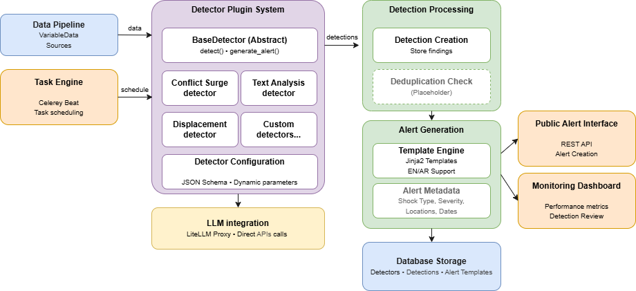

## 2. Alert framework

The alert framework provides a detection system that periodically analyzes data from the data pipeline to identify humanitarian alert conditions. Through a plugin-based detector architecture, the system identifies alert candidates ("detections"), applies deduplication logic, generates contextual alert messages, and creates alerts via the public alert interface API.

The framework supports multiple detection algorithms including statistical analysis, trend detection, anomaly detection, and LLM-based text analysis for comprehensive humanitarian monitoring.

### 2.1 Key concepts

#### Detector system
**Detectors** are pluggable components that analyze specific data variables to identify alert-worthy conditions. Each detector implements specialized logic for its domain - for example, a conflict surge detector analyzes ACLED event data to identify unusual increases in security incidents at district level over configurable time windows.

The detector architecture follows a plugin pattern similar to data sources, where each detector extends an abstract base class providing common functionality while implementing domain-specific detection algorithms. Detectors can employ various analytical approaches:
- **Statistical threshold detection**: Comparing metrics against configured thresholds
- **Trend analysis**: Identifying significant changes in time-series data
- **Anomaly detection**: Finding outliers using moving averages or statistical models
- **Pattern matching**: Detecting specific event sequences or combinations
- **LLM analysis**: Using large language models to analyze textual data for alert conditions

Each detector maintains its own configuration schema, allowing operators to tune detection parameters through the web interface without code modifications. Common configuration parameters include time windows, thresholds, geographic scope, and algorithm-specific settings.

#### Detection processing
**Detections** represent individual findings from detector analysis. Each detection captures the alert condition identified, affected locations, confidence scores, and detector-specific data that provides context for the finding. Detections serve as an intermediate representation between raw analysis and generated alerts, enabling review, deduplication, and quality control.

The detection lifecycle tracks each finding from initial identification through alert generation or dismissal. This audit trail supports performance analysis, algorithm tuning, and operational review of the detection system's effectiveness.

#### Deduplication mechanism
The **deduplication system** prevents redundant alerts by identifying related detections that represent the same underlying humanitarian event. While initially implemented as a simple placeholder that passes all detections through, the architecture supports future sophisticated deduplication logic including:
- Temporal proximity analysis (detections close in time)
- Geographic clustering (detections in nearby locations)
- Semantic similarity (detections with similar characteristics)
- Source correlation (related detections from different data sources)

The system maintains relationships between related detections, allowing operational analysis of detection patterns and improving deduplication algorithms over time.

#### Alert generation
**Alert generation** transforms validated detections into user-facing alerts with appropriate messaging, localization, and metadata. The generation process uses Jinja2 templates to create contextual alert messages in both English and Arabic, incorporating detection data like location names, metric values, and temporal information.

For the POC phase, alert generation is integrated directly into detectors through a `generate_alert()` method, providing simple implementation while maintaining flexibility for future architectural evolution. Each detector can override the default generation logic to provide domain-specific alert crafting.

Generated alerts include:
- **Multilingual content**: Title and description in English and Arabic from templates
- **Shock classification**: Type categorization for user filtering and visualization
- **Geographic scope**: Affected locations at appropriate administrative levels
- **Temporal context**: Event dates and validity periods
- **Source attribution**: Links to originating data sources for transparency
- **Severity assessment**: Priority ratings when applicable
- **Metadata**: Additional context for operational use

### 2.2 Architecture

The alert framework follows a modular, event-driven architecture with clear separation between detection, deduplication, and alert generation components.

<figure>
<figcaption>Alert framework architecture</figcaption>

</figure>

#### Core components

##### Detector plugin system
The plugin architecture enables extensible detection capabilities through a common interface:

**Abstract base detector** provides:
- `detect(start_date, end_date, **kwargs)`: Core detection logic implementation
- `get_configuration_schema()`: JSON schema defining configuration parameters
- `validate_configuration(config)`: Configuration validation logic
- `generate_alert(detection)`: Alert generation from detection results
- Common utilities for logging, data access, and location matching

**Concrete detector implementations** extend the base class with domain-specific logic while leveraging shared functionality. The dynamic loading system instantiates detectors based on database configuration, similar to the data source plugin pattern.

##### Detection execution flow
1. **Scheduling**: Celery Beat triggers detector tasks based on configured schedules
2. **Data retrieval**: Detector queries relevant VariableData within time window
3. **Analysis**: Detection algorithm processes data to identify alert conditions
4. **Detection creation**: Findings stored as Detection records with metadata
5. **Deduplication**: DuplicationChecker reviews detections (currently placeholder)
6. **Alert generation**: Non-duplicate detections trigger alert creation
7. **API integration**: Alerts created via public interface REST API
8. **Monitoring**: Execution metrics logged for performance analysis

##### Task integration
Each detector execution runs as an independent Celery task, providing:
- Isolated execution preventing detector interference
- Parallel processing capability for multiple detectors
- Retry logic for transient failures
- Timeout protection for long-running analysis
- Performance monitoring through task execution tracking

##### LLM integration for text analysis
The framework includes specialized support for LLM-powered text analysis through:

**TextAnalysisDetector base class** extending the standard detector with:
- LLM prompt configuration for detection logic
- Response parsing and validation
- Rate limiting and retry logic for API calls
- Cost tracking for LLM usage

**LiteLLM integration** providing:
- Unified interface to multiple LLM providers
- Centralized API key management
- Request/response logging for debugging
- Fallback provider configuration

LLM calls execute synchronously within detector tasks for POC simplicity, with architecture supporting future async refactoring if needed.

### 2.3 Data model

<figure>
<figcaption>Alert framework data model</figcaption>

</figure>


#### Model specification

##### Detector Model
**Purpose:** Configuration and metadata for detector plugins

**Key Fields:**
- `name`: Human-readable detector identifier (unique)
- `class_name`: Python class reference for dynamic loading
- `active`: Boolean flag for enabling/disabling detectors
- `configuration`: JSONField storing detector-specific parameters
- `schedule`: Foreign key to PeriodicTask for automated execution
- `last_run`: Timestamp of most recent execution
- `run_count`: Total number of executions for monitoring
- `detection_count`: Total detections created (performance metric)
- `created_at`/`updated_at`: Audit timestamps

**Business Rules:**
- Class name must reference valid detector implementation
- Configuration must validate against detector's schema
- Only active detectors included in scheduled execution
- Schedule optional for manual-only detectors

**Translation Support:** `name`, `description` fields support multiple languages

##### Detection Model
**Purpose:** Storage of individual detection results from detector analysis

**Key Fields:**
- `detector`: Foreign key to Detector that created this detection
- `detection_timestamp`: When the detected event/condition occurred
- `confidence_score`: Optional float (0-1) indicating detection confidence
- `shock_type`: Foreign key to ShockType for categorization
- `locations`: Many-to-many relationship with affected locations
- `detection_data`: JSONField for detector-specific data and context
- `status`: Processing status (pending, processed, dismissed)
- `alert`: Foreign key to generated Alert (null if not processed)
- `duplicate_of`: Self-referential foreign key for deduplication
- `created_at`: When detection was created
- `processed_at`: When detection was processed/dismissed

**Calculated Properties:**
- `is_duplicate`: Boolean indicating if linked to another detection
- `processing_duration`: Time between creation and processing

**Constraints:**
- Unique constraint on (detector, detection_timestamp, locations) to prevent duplicates
- Status transitions must follow valid workflow (pending → processed/dismissed)
- Alert can only be set when status is 'processed'

**Indexes:**
- Composite index on (detector, status, created_at) for processing queries
- Index on detection_timestamp for temporal queries
- Index on shock_type for categorization queries

##### AlertTemplate Model
**Purpose:** Multilingual message templates for alert generation

**Key Fields:**
- `name`: Template identifier (unique)
- `shock_type`: Foreign key to associated ShockType
- `title`: Alert title template
- `text`: Alert body template
- `variables`: JSONField documenting available template variables
- `active`: Boolean flag for template availability
- `created_at`/`updated_at`: Audit timestamps

**Template Features:**
- Jinja2 syntax for variable substitution
- Support for conditionals and loops
- Filters for date/number formatting
- Includes for common template fragments

**Business Rules:**
- Templates must include both English and Arabic versions
- Variable references must match detection data structure
- Templates validated for Jinja2 syntax on save

**Translation Support:** `title`, `text` fields support multiple languages

### 2.4 Implementation

#### Application structure
The alert framework is implemented as a standalone Django application with detector plugins, web interface, and API endpoints.

```
alert_framework/
├── management/
│   └── commands/
│       ├── run_detector.py              # Manual detector execution
│       ├── test_detection.py            # Detection testing on historical data
│       └── setup_detectors.py           # Initialize default detectors
├── detectors/
│   ├── __init__.py
│   ├── base.py                          # Abstract base detector class
│   ├── surge_detector.py                # Statistical surge detection
│   ├── text_analysis_detector.py        # LLM-based text analysis
│   └── README.md                        # Detector implementation guide
├── templates/alert_framework/
│   ├── base.html                        # Base template
│   ├── detector_list.html               # Detector management interface
│   ├── detector_detail.html             # Detector configuration/monitoring
│   ├── detection_list.html              # Detection review interface
│   └── detection_detail.html            # Individual detection details
├── migrations/                          # Database migrations
├── admin.py                             # Admin interface configuration
├── apps.py                              # App configuration
├── base_detector.py                     # Abstract detector implementation
├── deduplication.py                     # Deduplication logic (placeholder)
├── llm_utils.py                         # LLM integration utilities
├── models.py                            # Data models
├── tasks.py                             # Celery task definitions
├── forms.py                             # Configuration forms
├── views.py                             # Web interface views
├── api_views.py                         # API endpoints
├── urls.py                              # URL routing
└── tests/                               # Test suite
```

#### Base detector implementation

```python
from abc import ABC, abstractmethod
from typing import Dict, List, Optional
import logging
from datetime import datetime

class BaseDetector(ABC):
    """Abstract base class for all detection implementations."""

    def __init__(self, detector_config: 'Detector'):
        self.config = detector_config
        self.logger = logging.getLogger(f'detector.{self.__class__.__name__}')

    @abstractmethod
    def detect(self, start_date: datetime, end_date: datetime, **kwargs) -> List[Dict]:
        """
        Analyze data within time window and return detections.

        Returns list of detection dictionaries with required fields:
        - detection_timestamp: When the detected event occurred
        - locations: List of location IDs
        - confidence_score: Optional confidence (0-1)
        - detection_data: Additional detector-specific data
        """
        pass

    @abstractmethod
    def get_configuration_schema(self) -> Dict:
        """Return JSON schema for configuration validation."""
        pass

    def validate_configuration(self, config: Dict) -> bool:
        """Validate configuration against schema."""
        # Default implementation using jsonschema
        pass

    def generate_alert(self, detection: 'Detection') -> Dict:
        """
        Generate alert data from detection.

        Returns dictionary with alert fields for API creation.
        """
        # Default implementation using templates
        template = self.get_alert_template(detection)
        return self.render_alert(template, detection)

    # Utility methods
    def get_variable_data(self, variable_code: str, start_date: datetime,
                         end_date: datetime, locations: List = None):
        """Retrieve variable data within time window."""
        pass

    def log_detection(self, message: str, level: str = 'info'):
        """Structured logging for detection events."""
        pass
```

#### Example detector implementation

```python
class ConflictSurgeDetector(BaseDetector):
    """Detects unusual increases in conflict events."""

    def detect(self, start_date, end_date, **kwargs):
        detections = []

        # Get configuration parameters
        threshold_multiplier = self.config.configuration.get('threshold_multiplier', 2.0)
        min_events = self.config.configuration.get('min_events', 5)

        # Retrieve ACLED event data
        event_data = self.get_variable_data(
            'acled_events',
            start_date,
            end_date
        )

        # Group by location and analyze
        for location_id, location_events in self.group_by_location(event_data):
            # Calculate statistics
            recent_count = self.count_recent_events(location_events)
            historical_avg = self.calculate_historical_average(location_id)

            # Detect surge
            if recent_count > historical_avg * threshold_multiplier and recent_count >= min_events:
                detections.append({
                    'detection_timestamp': end_date,
                    'locations': [location_id],
                    'confidence_score': self.calculate_confidence(recent_count, historical_avg),
                    'detection_data': {
                        'recent_count': recent_count,
                        'historical_average': historical_avg,
                        'surge_factor': recent_count / historical_avg
                    }
                })

        return detections

    def get_configuration_schema(self):
        return {
            'type': 'object',
            'properties': {
                'threshold_multiplier': {
                    'type': 'number',
                    'minimum': 1.0,
                    'default': 2.0,
                    'description': 'Multiplier for surge detection'
                },
                'min_events': {
                    'type': 'integer',
                    'minimum': 1,
                    'default': 5,
                    'description': 'Minimum events to trigger detection'
                }
            }
        }
```

#### Celery task integration

```python
@shared_task(bind=True, max_retries=3)
def run_detector_task(self, detector_id: int, start_date: str, end_date: str):
    """Execute detector and process results."""
    try:
        # Load detector configuration
        detector_model = Detector.objects.get(pk=detector_id)

        # Dynamically load detector class
        detector_class = import_string(f'alert_framework.detectors.{detector_model.class_name}')
        detector = detector_class(detector_model)

        # Run detection
        detections = detector.detect(
            datetime.fromisoformat(start_date),
            datetime.fromisoformat(end_date)
        )

        # Process detections
        for detection_data in detections:
            # Create Detection record
            detection = Detection.objects.create(
                detector=detector_model,
                **detection_data
            )

            # Run deduplication
            if not DuplicationChecker().is_duplicate(detection):
                # Generate and create alert
                alert_data = detector.generate_alert(detection)
                create_alert_via_api(alert_data)
                detection.status = 'processed'
                detection.save()

        # Update monitoring metrics
        detector_model.last_run = timezone.now()
        detector_model.run_count += 1
        detector_model.detection_count += len(detections)
        detector_model.save()

    except Exception as exc:
        self.retry(exc=exc, countdown=60)
```

### 2.5 API endpoints

| **Endpoint** | **Method** | **Purpose** |
| --- | --- | --- |
| **/alert_framework/api/detectors/** | GET | List configured detectors with statistics |
| **/alert_framework/api/detectors/{id}/** | GET, PUT | Retrieve/update detector configuration |
| **/alert_framework/api/detectors/{id}/run/** | POST | Manually trigger detector execution |
| **/alert_framework/api/detectors/{id}/test/** | POST | Test detector on historical data |
| **/alert_framework/api/detections/** | GET | List detections with filtering |
| **/alert_framework/api/detections/{id}/** | GET | Retrieve detection details |
| **/alert_framework/api/detections/{id}/dismiss/** | POST | Dismiss detection without alert |
| **/alert_framework/api/templates/** | GET, POST | Manage alert templates |
| **/alert_framework/api/statistics/** | GET | Framework performance metrics |

### 2.6 Web interface

The alert framework provides a web interface for detector management, detection monitoring, and performance analysis.

#### Detector management
The detector list interface displays all configured detectors with status indicators, execution statistics, and quick action buttons for configuration and manual execution.

<figure>
<figcaption>Alert framework - Detector list</figcaption>

</figure>

Individual detector pages provide:
- Configuration editing with schema-driven forms
- Execution history and performance metrics
- Detection statistics and patterns
- Test execution on historical data

#### Detection monitoring
The detection interface enables review of identified alert conditions with filtering, status tracking, and manual review capabilities.

<figure>
<figcaption>Alert framework - Detection monitoring</figcaption>

</figure>

Features include:
- Real-time detection feed with auto-refresh
- Filtering by detector, status, location, and time range
- Bulk actions for processing multiple detections
- Detailed view with full detection context and generated alerts
- Manual dismissal with reason tracking

#### Performance dashboard
The framework dashboard provides operational insights including:
- Detector execution statistics and success rates
- Detection patterns and trends over time
- Alert generation metrics and API integration status
- System health indicators and error tracking
