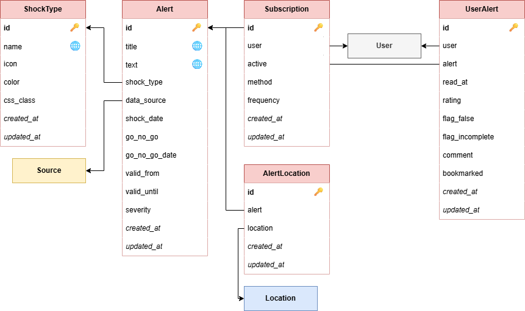
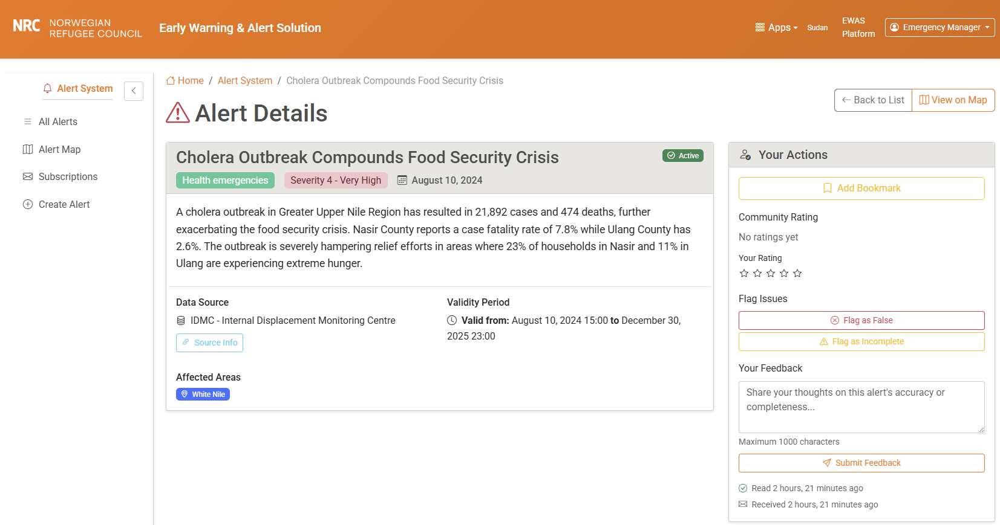
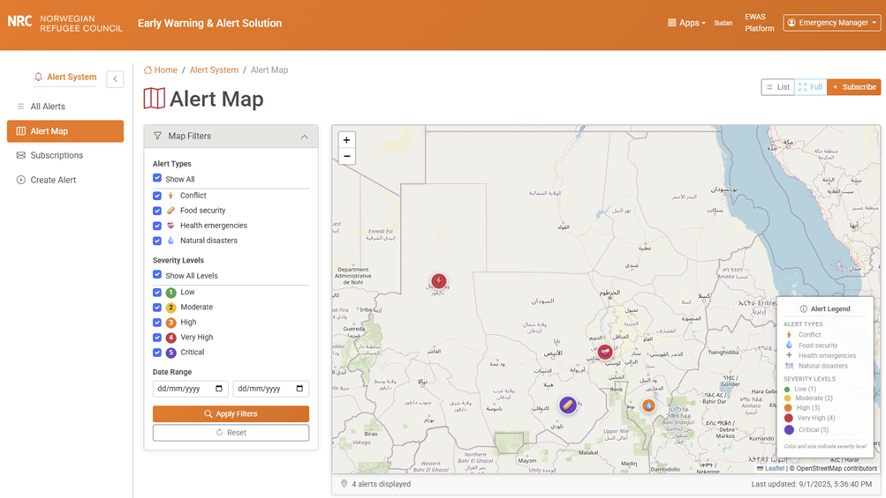
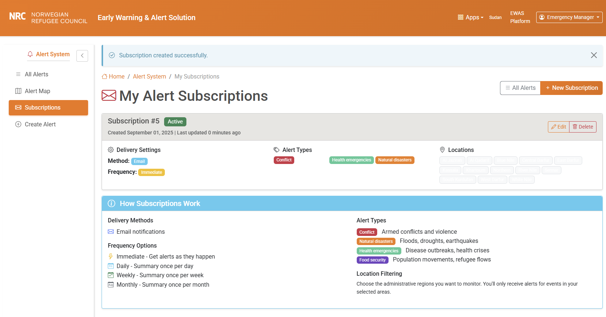

## 6. Public alert interface

The public alert interface provides a user-facing application for alert distribution, subscription management, and user engagement with early warning notifications. This system serves as the primary interface between generated alerts and end users, enabling targeted notification delivery and user feedback mechanisms.

The application manages the alert lifecycle from public distribution through user interaction tracking, providing subscription management, geographic filtering, and multi-channel notification capabilities.

### 6.1 Key concepts

#### Alert distribution system

The **alert distribution system** transforms internally generated alerts into public-facing notifications through an approval workflow. Alerts must receive explicit "Go/No-Go" approval before becoming visible to end users, ensuring that all distributed alerts meet quality and accuracy standards.

The system maintains complete separation between internal alert generation (handled by the alert framework described in section 2) and public distribution, allowing for editorial oversight and quality control. Only approved alerts (`go_no_go=True`) are accessible through the public interface.

**Validity periods** define the temporal scope during which alerts remain active and relevant. Each alert includes `valid_from` and `valid_until` timestamps, allowing for precise control over alert lifecycle and automatic expiration of time-sensitive information.

#### Shock type classification

**Shock types** provide thematic categorization of alerts, enabling users to subscribe to specific types of humanitarian concerns. Each shock type includes visual configuration (color scheme, iconography) and semantic classification to ensure consistent presentation and intuitive user navigation.

The system supports flexible shock type management through the admin interface, allowing new categories to be added as humanitarian contexts evolve. Common shock types include conflict events, natural disasters, health emergencies and food security alerts.

#### User subscription framework

**Subscription management** enables users to create personalized alert preferences based on geographic scope, shock type interests, delivery frequency, and notification methods. The system supports geographic filtering at administrative level 1 (state level) to ensure users receive relevant local information.

**Notification delivery** operates through configurable frequency settings (immediate, daily, weekly, monthly) with email as the primary delivery method. The architecture supports extension to additional delivery channels (SMS, push notifications) as operational requirements evolve.

**Subscription filtering** allows users to combine multiple criteria: specific geographic areas of interest, particular shock types, and severity thresholds. This multi-dimensional filtering ensures users receive precisely targeted information relevant to their operational context.

#### User interaction tracking
**Comprehensive interaction tracking** captures user engagement patterns through read status, bookmark management, rating systems, and feedback collection. This data serves both user experience optimization and alert quality assessment purposes.

**Rating and feedback systems** enable users to provide structured feedback on alert accuracy, completeness, and relevance. Ratings use a 5-point scale, while feedback includes flagging mechanisms for false or incomplete alerts and open-text commentary for detailed user input.

**Behavioral analytics** track user engagement patterns to optimize notification timing, content relevance, and interface design. All tracking respects user privacy while providing operational insights for system improvement.

### 6.2 Architecture

The public alert interface follows a layered architecture with clear separation between public-facing interfaces, subscription management, and notification delivery systems.

#### Core components
- **Public Web Interface**: User-facing views for alert browsing, subscription management, and interaction
- **Subscription Engine**: Logic for matching alerts to user preferences and managing delivery schedules
- **Notification System**: Multi-channel delivery system for distributing alerts to subscribed users
- **User Interaction Tracker**: System for capturing and analyzing user engagement with alerts
- **Geographic Filter Engine**: Spatial matching system linking alerts to user location preferences

#### Integration points
The alert interface integrates with core system components:
- **Data Pipeline Integration**: Links alerts to originating data sources for transparency and traceability
- **Location Framework**: Uses hierarchical location system for geographic filtering and alert targeting
- **Translation System**: Provides multilingual alert content and interface localization
- **Authentication System**: Django user management for subscription and interaction tracking

#### Distribution workflow
1. **Alert Approval**: Internal alerts receive Go/No-Go approval through administrative interface
2. **Subscription Matching**: System identifies users whose subscription criteria match alert parameters
3. **Notification Scheduling**: Delivery schedule respects user frequency preferences and system capacity
4. **Multi-Channel Delivery**: Notifications sent through user-preferred channels with delivery tracking
5. **Interaction Capture**: User engagement tracked for analytics and alert quality assessment

### 6.3 Data model

<figure>
<figcaption>Public alert interface data model</figcaption>

</figure>

#### Model specification

##### ShockType Model
**Purpose:** Categorizes alerts by thematic content and provides visual configuration

**Key Fields:**
- `name`: Unique shock type identifier (e.g., "Conflict", "Natural Disasters")
- `icon`: Visual icon/emoji for interface display
- `color`: Hex color code for consistent visual theming
- `css_class`: Auto-generated CSS class for styling consistency

**Business Rules:**
- Names must be unique across all shock types
- CSS classes auto-generated from names if not provided
- Color codes must be valid hexadecimal format
- Icons support both emoji and symbol characters

**Visual Integration:**
- Automatic CSS class generation: converts names to lowercase, replaces spaces with hyphens
- Consistent color theming across map markers, badges, and interface elements
- Icon standardization for immediate visual recognition

##### Alert Model
**Purpose:** Core alert content with approval workflow and validity management

**Key Fields:**
- `title`: Alert headline/summary (max 255 characters)
- `text`: Detailed alert content and context
- `shock_type`: Foreign key to ShockType for categorization
- `data_source`: Link to originating data pipeline source
- `shock_date`: Date of the underlying event/shock
- `go_no_go`: Boolean approval flag for public distribution
- `go_no_go_date`: Timestamp of approval decision
- `valid_from`/`valid_until`: Temporal validity window
- `severity`: 1-5 scale severity rating
- `locations`: Many-to-many relationship with geographic areas

**Calculated Properties:**
- `is_active`: Computed property checking current time against validity window
- `severity_display`: Human-readable severity level translation

**Constraints:**
- Only approved alerts (`go_no_go=True`) accessible through public interface
- Validity period must be logical (`valid_from` ≤ `valid_until`)
- Severity values constrained to 1-5 range with validation
- Location relationships required for geographic targeting

**Indexes:**
- Composite index on (shock_type, severity) for filtered queries
- Index on (shock_date, go_no_go) for chronological alert lists
- Index on validity period for active alert queries

##### Subscription Model
**Purpose:** User notification preferences and delivery configuration

**Key Fields:**
- `user`: Foreign key to Django User model
- `locations`: Many-to-many relationship with Location model (ADM1 level filtering)
- `shock_types`: Many-to-many relationship with interested shock types
- `active`: Boolean flag for subscription status
- `method`: Delivery method (currently email, extensible)
- `frequency`: Notification frequency (immediate, daily, weekly, monthly)

**Filtering Logic:**
- Geographic filtering operates at administrative level 1 (state/province)
- Multiple location selection supported for users with broader interests
- Shock type filtering allows granular subscription to specific alert categories
- Frequency settings respect user preferences while managing system load

**Business Rules:**
- Users can create multiple subscriptions with different parameters
- Inactive subscriptions preserved for historical tracking
- Geographic scope limited to ADM1 level for performance optimization
- Email delivery method currently supported with extensibility for additional channels

##### UserAlert Model
**Purpose:** Comprehensive tracking of user interactions with specific alerts

**Key Fields:**
- `user`/`alert`: Unique combination identifying user-alert relationship
- `received_at`: Timestamp when notification delivered to user
- `read_at`: Timestamp when user first viewed alert details
- `rating`: 1-5 scale user rating of alert accuracy/usefulness
- `rating_at`: Timestamp of rating submission
- `flag_false`/`flag_incomplete`: Boolean flags for alert quality issues
- `comment`: Open-text feedback from user
- `bookmarked`: Personal bookmark flag for important alerts

**Interaction Tracking:**
- Complete audit trail from notification delivery through user engagement
- Rating system provides quantitative feedback on alert quality
- Flagging system enables community-driven quality control
- Bookmark functionality supports personal alert management

### 6.4 Implementation

#### Application structure
The alerts application is implemented as a standalone Django application with comprehensive web interface and API support.

```
alerts/
├── management/
│   └── commands/
│       ├── send_alert_notifications.py    # Scheduled notification delivery
│       └── cleanup_expired_alerts.py      # Database maintenance
├── templates/alerts/
│   ├── base.html                          # Base template with navigation
│   ├── alert_list.html                    # Main alert browsing interface
│   ├── alert_detail.html                  # Individual alert details
│   ├── alert_map.html                     # Geographic alert visualization
│   ├── subscription_list.html             # User subscription management
│   ├── subscription_form.html             # Subscription creation/editing
│   └── subscription_confirm_delete.html   # Subscription deletion confirmation
├── static/alerts/
│   ├── css/
│   │   └── alerts.css                     # Alert-specific styling
│   └── js/
│       ├── alert_interactions.js          # Rating, bookmarking, feedback
│       ├── alert_map.js                   # Interactive map functionality
│       └── subscription_forms.js         # Dynamic form handling
├── migrations/                            # Database schema migrations
├── admin.py                               # Enhanced admin interface
├── api.py                                 # RESTful API endpoints
├── apps.py                                # Application configuration
├── models.py                              # Core data models
├── views.py                               # Main web interface views
├── forms.py                               # Form definitions and validation
├── urls.py                                # URL routing configuration
├── tasks.py                               # Celery notification tasks
└── tests/                                 # Comprehensive test suite
```

#### Enhanced admin interface
The Django admin interface includes specialized functionality for alert management:

**Alert Administration:**
- Bulk approval/rejection workflows for efficient alert processing
- Rich text editing for alert content with preview capabilities
- Geographic location selection with map integration
- Severity assignment with visual indicators

**Shock Type Management:**
- Color picker widgets for theme consistency
- Emoji/icon selection with preview
- CSS class auto-generation with override capabilities

**User Interaction Analytics:**
- Read/unread status tracking across alerts
- Rating distribution analytics with filtering
- Flagged content review with administrative actions
- User feedback compilation and response tracking

#### Notification delivery system
**Scheduled Notifications:**
```python
# Daily notification digest processing
@shared_task
def send_daily_alert_digest():
    """Process daily alert notifications for subscribed users."""
    from django.utils import timezone
    from datetime import timedelta

    yesterday = timezone.now() - timedelta(days=1)

    # Get users with daily notification preferences
    daily_subscriptions = Subscription.objects.filter(
        active=True,
        frequency='daily'
    ).select_related('user').prefetch_related(
        'locations', 'shock_types'
    )

    for subscription in daily_subscriptions:
        # Find matching alerts from yesterday
        alerts = Alert.objects.filter(
            go_no_go=True,
            created_at__gte=yesterday,
            shock_type__in=subscription.shock_types.all(),
            locations__in=subscription.locations.all()
        ).distinct()

        if alerts.exists():
            send_digest_email(subscription.user, alerts)
```

**Real-time Notification Processing:**
The system supports immediate notification delivery for high-priority alerts through Celery task queues, ensuring rapid distribution while maintaining delivery reliability.

#### User interaction handling
**AJAX Interaction Endpoints:**
```python
@login_required
@require_POST
def rate_alert(request, alert_id):
    """Handle alert rating submission."""
    alert = get_object_or_404(Alert, pk=alert_id, go_no_go=True)
    rating = int(request.POST.get('rating'))

    if not (1 <= rating <= 5):
        return JsonResponse({'error': 'Invalid rating'}, status=400)

    user_alert, created = UserAlert.objects.get_or_create(
        user=request.user,
        alert=alert,
        defaults={'received_at': timezone.now()}
    )

    user_alert.rating = rating
    user_alert.rating_at = timezone.now()
    user_alert.save(update_fields=['rating', 'rating_at'])

    return JsonResponse({'success': True, 'rating': rating})
```

### 6.5 API endpoints

The Alert System provides comprehensive API access through three distinct endpoint categories: authenticated endpoints for user-specific interactions, public endpoints for external integrations, and webhook endpoints for programmatic alert creation.

#### Authenticated API endpoints (require user login)
| **Endpoint** | **Method** | **Purpose** |
| --- | --- | --- |
| **/alerts/api/alerts/** | GET | List alerts with user-specific interaction data and comprehensive filtering |
| **/alerts/api/alert/{id}/** | GET | Retrieve detailed alert information including user interaction status |
| **/alerts/api/shock-types/** | GET | List available shock types with alert counts |
| **/alerts/api/subscriptions/** | GET | List user subscription preferences with locations and shock types |
| **/alerts/api/stats/** | GET | Alert statistics with user-specific engagement metrics |
| **/alerts/alert/{id}/rate/** | POST | Submit alert rating (1-5 stars, AJAX endpoint) |
| **/alerts/alert/{id}/bookmark/** | POST | Toggle alert bookmark status (AJAX endpoint) |
| **/alerts/alert/{id}/flag/** | POST | Flag alert as false/incomplete (AJAX endpoint) |
| **/alerts/alert/{id}/feedback/** | POST | Submit detailed alert feedback (AJAX endpoint) |

#### Public API endpoints (external integrations)

| **Endpoint** | **Method** | **Purpose** |
| --- | --- | --- |
| **/alerts/api/public/alerts/** | GET | List approved alerts with community statistics and comprehensive filtering |
| **/alerts/api/public/shock-types/** | GET | List shock types with alert counts and styling information |
| **/alerts/api/public/stats/** | GET | Comprehensive alert statistics for dashboards and analytics |

#### Webhook endpoints (programmatic alert creation)
| **Endpoint** | **Method** | **Purpose** |
| --- | --- | --- |
| **/alerts/webhook/alert/create/** | POST | Create new alerts via webhook for external systems integration |

#### API filtering capabilities
All list endpoints support comprehensive filtering:
- **Geographic filtering**: Filter alerts by affected locations (ADM1 level) with comma-separated location IDs
- **Temporal filtering**: Date range queries on shock date and creation date with ISO format support
- **Thematic filtering**: Filter by shock type, severity level (1-5), and approval status
- **Active status filtering**: Show only currently active alerts within validity period (default for public APIs)
- **User-specific filtering**: Personal bookmarks, read/unread status, rated alerts (authenticated endpoints)
- **Search functionality**: Full-text search across alert titles and content
- **Pagination**: Configurable page sizes with maximum limits (100 items for public APIs, 1000 for authenticated)

#### External integration features
The public API endpoints are specifically designed for third-party system integration:
- **No authentication required**: Direct access for external systems and dashboards
- **Community data aggregation**: Average ratings, flag counts, and engagement metrics
- **Webhook support**: Programmatic alert creation with comprehensive validation
- **Standards compliance**: ISO date formats, RESTful design patterns, and consistent error responses
- **Performance optimization**: Efficient pagination, query optimization, and response caching

### 6.6 Web interface

The public alert interface provides an intuitive, responsive web application designed for both desktop and mobile humanitarian workers accessing critical alert information.

#### Alert browsing interface
The main alert list provides comprehensive filtering, search, and sorting capabilities with real-time updates and infinite scroll for seamless navigation through large alert datasets.

<figure>
<figcaption>Public alert interface - Alert list</figcaption>

</figure>

Key features include:
- **Filtering**: Multi-dimensional filtering by shock type, severity, date range, and geographic area
- **Visual indicators**: Color-coded severity levels, shock type icons, and read/unread status
- **Search functionality**: Real-time search across alert titles and content
- **Personal organization**: Bookmark management and personal reading history
- **Responsive design**: Optimized layouts for desktop, tablet, and mobile access

#### Alert detail view
Individual alert pages provide comprehensive information with user interaction capabilities and related alert suggestions.

<figure>
<figcaption>Public alert interface - Alert details</figcaption>

</figure>

The detail view includes:
- **Complete alert content**: Full text, contextual information, and source attribution
- **Geographic context**: Interactive map showing affected locations with administrative boundaries
- **User interactions**: Rating system, bookmark controls, and feedback submission
- **Metadata display**: Data source information, validity period, and alert lifecycle details
- **Related alerts**: Algorithmically suggested similar or geographically related alerts

#### Geographic visualization
The interactive map interface provides spatial context for alerts with advanced filtering and clustering capabilities.

<figure>
<figcaption>Public alert interface - Geographic map</figcaption>

</figure>

Map features include:
- **Spatial clustering**: Alert grouping at different zoom levels for performance optimization
- **Interactive filtering**: Real-time map updates based on filter selections
- **Multi-layer visualization**: Administrative boundaries, alert locations, and affected areas
- **Popup information**: Immediate alert summary on marker interaction
- **Export capabilities**: Map snapshot and alert data export functionality

#### Subscription management
The subscription management interface allows users to create, modify, and monitor their notification preferences.

<figure>
<figcaption>Public alert interface - Subscription management</figcaption>

</figure>

Subscription features include:
- **Geographic selection**: Interactive map for selecting areas of interest at ADM1 level
- **Thematic preferences**: Multi-select shock type preferences with visual indicators
- **Delivery configuration**: Frequency settings and notification method preferences
- **Subscription monitoring**: Analytics on received alerts and delivery statistics
- **Multiple subscriptions**: Support for different subscription profiles for various operational needs
