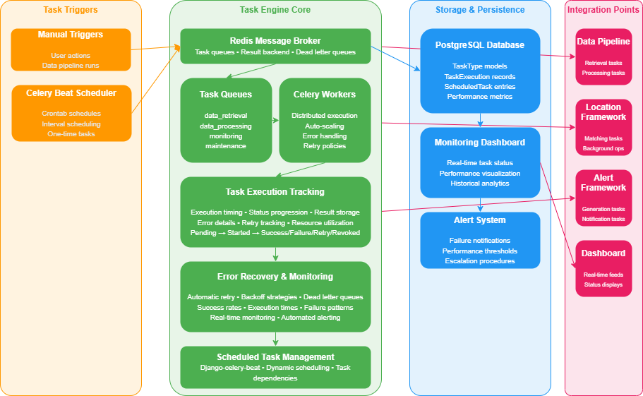
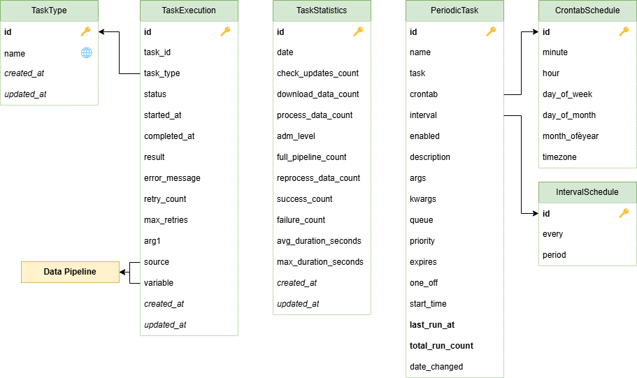
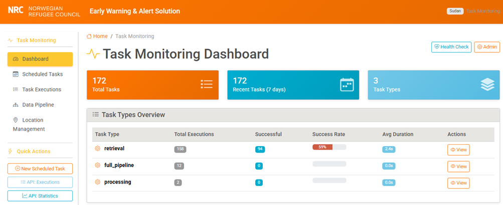
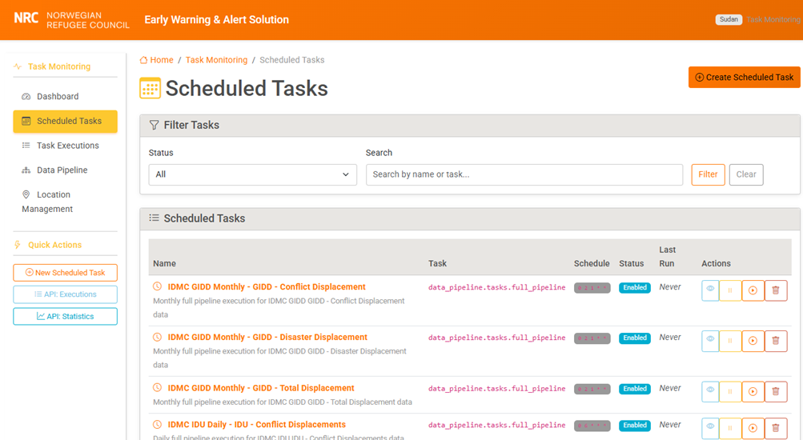
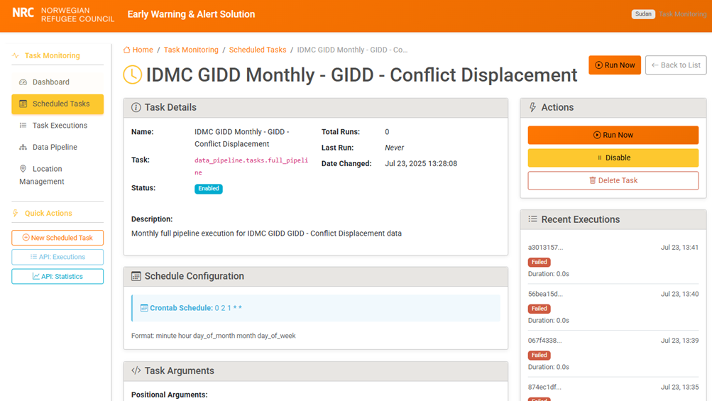
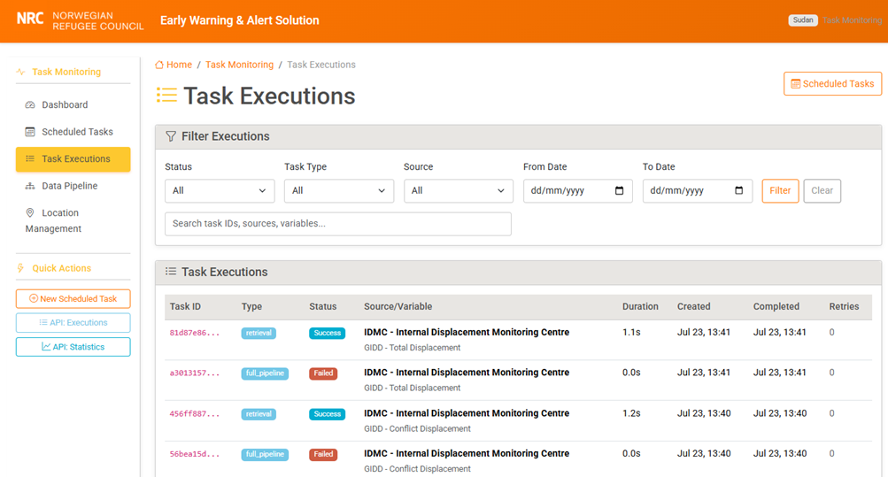

## 7. Task engine

The task engine provides task scheduling, execution monitoring, and performance tracking capabilities for the EWAS platform. Built on Celery with Redis as the message broker, it ensures reliable asynchronous processing of data operations while providing real-time visibility into system performance.

The engine handles both manual task execution (triggered by user actions) and automated scheduling (periodic execution through Celery Beat), with sophisticated error recovery mechanisms and detailed execution tracking.

### 7.1 Key concepts

#### Task management system
The **task management system** uses Celery with Redis as the message broker to provide scalable, reliable asynchronous processing. This architecture choice reflects the reality that data processing operations can be time-consuming and shouldn't block the user interface or other system operations.

The system implements **queue-based task routing** where different task types are routed to specialized queues (data_retrieval, data_processing, monitoring) to ensure optimal resource allocation and prevent task type interference. Each queue can be scaled independently based on workload characteristics.

#### Task types
**Task types** are organized by function, with separate task definitions for data retrieval, processing, aggregation, and monitoring operations. Each task type has specific retry policies and error handling logic appropriate to its function. For example, retrieval tasks have aggressive retry policies with exponential backoff to handle temporary network issues, while processing tasks have more conservative retry policies since processing failures usually indicate data quality issues that won't resolve with simple retries.

The system supports the following primary task types:
- **Retrieval tasks**: Fetch raw data from external sources with network error resilience
- **Processing tasks**: Transform raw data into standardized format with validation
- **Aggregation tasks**: Generate derived statistics and summaries
- **Monitoring tasks**: System health checks and performance metric collection
- **Maintenance tasks**: Database cleanup, log rotation, and system optimization

#### Task execution tracking
The **task execution tracking system** provides comprehensive monitoring of individual task lifecycles. Each task execution is tracked from initiation through completion, with detailed metadata including:

- **Execution timing**: Start time, completion time, and calculated duration
- **Status progression**: Pending → Started → Success/Failure/Retry/Revoked
- **Result storage**: Task outputs stored in JSON format for analysis
- **Error details**: Complete error messages and stack traces for failed tasks
- **Retry tracking**: Current retry count against maximum retry limits
- **Resource utilization**: Memory and CPU usage metrics (where available)

#### Scheduled task management
**Task scheduling** supports both on-demand execution (triggered by user actions) and periodic execution (scheduled through Celery Beat). The scheduling system integrates with django-celery-beat to provide:

- **Crontab scheduling**: Complex time-based schedules with full cron syntax support
- **Interval scheduling**: Simple periodic execution (every N seconds/minutes/hours)
- **One-time scheduling**: Future task execution at specific timestamps
- **Task dependencies**: Sequential task chains where completion triggers related tasks
- **Schedule management**: Dynamic creation, modification, and deletion of scheduled tasks

The system includes predefined schedules for common operations:
- Daily data pipeline execution at 6:00 AM UTC for IDMC sources
- Weekly data validation checks at 5:00 AM Monday UTC
- Hourly system health monitoring
- Daily performance statistics aggregation at 1:00 AM UTC

#### Error recovery and monitoring
**Error recovery** mechanisms include automatic retry with configurable backoff strategies, dead letter queue handling for persistently failed tasks, and escalation procedures for critical failures. The system maintains comprehensive metrics on task success rates, execution times, and failure patterns, providing operational insights for capacity planning and performance optimization.

**Real-time monitoring** capabilities include live dashboard updates, automated alerting for task failures, and performance trend analysis. The monitoring system tracks both individual task performance and aggregate system health metrics.

### 7.2 Architecture

The task engine architecture follows a distributed processing model with clear separation between task scheduling, execution, and monitoring components.

<figure>
<figcaption>Task engine architecture</figcaption>

</figure>

#### Core components
- **Celery Workers**: Distributed task execution processes handling different queue types
- **Redis Broker**: Message queue and result backend for task communication
- **Celery Beat**: Scheduler daemon for periodic task execution
- **Django Integration**: Web interface and database persistence layer
- **Monitoring Dashboard**: Real-time task execution visualization

#### Task execution flow
1. **Task Creation**: Tasks are created either through scheduled triggers or manual user actions
2. **Queue Routing**: Tasks are routed to appropriate queues based on task type and priority
3. **Worker Assignment**: Available workers claim tasks from their assigned queues
4. **Execution Tracking**: Task execution is monitored with real-time status updates
5. **Result Storage**: Task results and metadata are persisted to the database
6. **Error Handling**: Failed tasks are retried according to configured policies or moved to dead letter queues

#### Integration points
The task engine integrates deeply with other system components:
- **Data Pipeline**: All data retrieval and processing operations are executed as tasks
- **Location Framework**: Location matching operations run as background tasks
- **Alert Framework**: Alert generation and notification tasks are managed by the engine
- **Dashboard**: Real-time task status feeds dashboard displays

### 7.3 Data model

<figure>
<figcaption>Task engine data model</figcaption>

</figure>

#### Model specification

##### TaskType Model
**Purpose:** Categorizes different types of tasks that can be executed in the system

**Key Fields:**
- `name`: Unique identifier for task types (e.g., 'retrieval', 'processing', 'aggregation')
- `description`: Human-readable description of the task type's purpose
- `created_at`/`updated_at`: Timestamp tracking for audit purposes

**Business Rules:**
- Task type names must be unique across the system
- Task types cannot be deleted if associated executions exist
- Names must follow Python identifier conventions (lowercase, underscores)

**Translation Support:** `description` field supports multiple languages through django-modeltranslation

##### TaskExecution Model
**Purpose:** Comprehensive tracking of individual Celery task executions with performance metrics

**Key Fields:**
- `task_id`: Unique Celery task identifier (UUID format)
- `task_type`: Foreign key to TaskType for categorization
- `status`: Execution status enum (pending, started, success, failure, retry, revoked)
- `started_at`/`completed_at`: Precise execution timing with timezone support
- `result`: JSONField storing task output data and metadata
- `error_message`: Complete error details for failed tasks (TextField)
- `retry_count`/`max_retries`: Retry mechanism tracking
- `arg1`: Generic parameter storage for task arguments
- `source`/`variable`: Foreign keys linking to data pipeline entities

**Calculated Properties:**
- `duration_seconds`: Computed execution time (completed_at - started_at)
- `is_completed`: Boolean indicating final status (success/failure/revoked)
- `can_retry`: Eligibility for retry based on current count vs. maximum
- `success_rate`: Historical success rate for similar tasks

**Constraints:**
- Unique constraint on task_id to prevent duplicate tracking
- Check constraint ensuring started_at ≤ completed_at when both are set
- Conditional validation requiring error_message for failed tasks

**Indexes:**
- Primary index on task_id for rapid Celery integration queries
- Composite index on (task_type, status, started_at) for dashboard queries
- Index on (source, variable) for data pipeline integration
- Index on created_at for recent task queries

##### PeriodicTask Integration
The system leverages django-celery-beat's PeriodicTask model for scheduled task management, extending it with custom admin interfaces and validation logic specific to EWAS requirements.

### 7.4 Implementation

#### Application structure
The task monitoring application is implemented as a standalone Django application with deep integration points throughout the platform.

```
task_monitoring/
├── management/
│   └── commands/
│       ├── setup_scheduled_tasks.py    # Automated task schedule setup
│       └── cleanup_old_executions.py   # Database maintenance
├── templates/task_monitoring/
│   ├── base.html                       # Base template with navigation
│   ├── dashboard.html                  # Real-time monitoring dashboard
│   ├── executions_list.html            # Task execution history
│   ├── scheduled_tasks.html            # Scheduled task management
│   └── task_detail.html                # Individual task execution details
├── static/task_monitoring/
│   ├── css/
│   │   └── dashboard.css               # Dashboard-specific styling
│   └── js/
│       ├── dashboard.js                # Real-time updates and filtering
│       └── task_actions.js             # Task management interactions
├── migrations/                         # Database schema migrations
├── admin.py                           # Enhanced admin interface
├── apps.py                            # Application configuration
├── models.py                          # Core data models
├── views.py                           # Main web interface views
├── scheduled_views.py                 # Scheduled task management views
├── api_views.py                       # RESTful API endpoints
├── forms.py                           # Form definitions and validation
├── serializers.py                     # API serialization logic
├── urls.py                            # URL routing configuration
├── tasks.py                           # Task execution utilities
├── utils.py                           # Helper functions and decorators
└── tests/                             # Comprehensive test suite
```

#### Celery integration
The task engine provides seamless integration with Celery tasks through helper functions and decorators:

```python
# Task execution tracking integration
@shared_task(bind=True, max_retries=3, default_retry_delay=60)
def data_retrieval_task(self, source_id, variable_id):
    """Example task with integrated monitoring."""
    execution = create_task_execution(
        task_id=self.request.id,
        task_type='retrieval',
        source_id=source_id,
        variable_id=variable_id
    )

    try:
        # Task execution logic
        result = perform_data_retrieval(source_id, variable_id)
        update_task_execution(execution, 'success', result=result)
        return result
    except Exception as exc:
        update_task_execution(execution, 'failure', error_message=str(exc))
        raise self.retry(exc=exc)
```

#### Task queue configuration
The system implements sophisticated queue routing to optimize resource utilization:

```python
# Celery routing configuration
CELERY_TASK_ROUTES = {
    'data_pipeline.tasks.retrieve_*': {'queue': 'data_retrieval'},
    'data_pipeline.tasks.process_*': {'queue': 'data_processing'},
    'task_monitoring.tasks.*': {'queue': 'monitoring'},
    'location.tasks.*': {'queue': 'location_processing'}
}
```

#### Scheduled task automation
The system includes management commands for automated setup of common scheduled tasks:

```python
# Automated scheduled task setup
def setup_idmc_tasks():
    """Setup IDMC-specific scheduled tasks."""
    PeriodicTask.objects.get_or_create(
        name='IDMC Daily Pipeline',
        defaults={
            'task': 'data_pipeline.tasks.run_full_pipeline',
            'crontab': CrontabSchedule.objects.get_or_create(
                hour=6, minute=0  # 6:00 AM UTC daily
            )[0],
            'kwargs': json.dumps({'source': 'idmc'})
        }
    )
```

### 7.5 API endpoints

| **Endpoint** | **Method** | **Purpose** |
| --- | --- | --- |
| **/tasks/api/executions/** | GET | List task executions with comprehensive filtering |
| **/tasks/api/executions/{id}/** | GET | Retrieve detailed execution information |
| **/tasks/api/executions/{id}/retry/** | POST | Manually retry a failed task execution |
| **/tasks/api/types/** | GET | List task types with execution statistics |
| **/tasks/api/types/{name}/stats/** | GET | Detailed statistics for specific task type |
| **/tasks/api/statistics/** | GET | Aggregate system performance statistics |
| **/tasks/api/scheduled/** | GET, POST | List and create scheduled tasks |
| **/tasks/api/scheduled/{id}/** | GET, PUT, DELETE | Manage individual scheduled tasks |
| **/tasks/api/scheduled/{id}/run/** | POST | Manually trigger scheduled task execution |
| **/tasks/api/health/** | GET | System health check and queue status |

#### API filtering and pagination
All list endpoints support comprehensive filtering options:
- **Status filtering**: Filter by execution status (success, failure, pending, etc.)
- **Date range filtering**: Filter by execution date ranges
- **Task type filtering**: Filter by specific task types
- **Source/Variable filtering**: Filter by associated data pipeline entities
- **Pagination**: Configurable page sizes with cursor-based pagination for large datasets

### 7.6 Web interface

The task engine's web interface provides comprehensive task management capabilities through an intuitive dashboard-driven experience. The interface allows users to monitor real-time task execution, manage scheduled tasks, analyze performance trends, and manually trigger task operations.

#### Dashboard
The main dashboard provides a real-time overview of system activity with automatically refreshing statistics, recent task execution summaries, and performance trend visualization. The dashboard updates every 30 seconds to provide live system status without requiring manual page refreshes.

<figure>
<figcaption>Task engine - dashboard</figcaption>

</figure>

Key dashboard features include:
- **Real-time metrics**: Live task execution counts, success rates, and queue depths
- **Performance trends**: Historical execution time and success rate charts
- **System health indicators**: Queue status, worker availability, and error rate alerts
- **Quick actions**: Direct access to common task management operations

#### Scheduled task management
The scheduled tasks interface provides complete lifecycle management for periodic task execution, including creation, modification, and monitoring of scheduled operations.

<figure>
<figcaption>Task engine – Scheduled tasks</figcaption>

</figure>

Users can:
- **Create schedules**: Define new periodic tasks with crontab or interval timing
- **Modify schedules**: Update timing, parameters, or enable/disable existing tasks
- **Monitor execution**: View execution history and performance for each scheduled task
- **Manual execution**: Trigger scheduled tasks on-demand for testing or emergency operations

#### Scheduled task details
Individual scheduled task management provides granular control over task configuration and execution monitoring.

<figure>
<figcaption>Task engine – Scheduled task details</figcaption>

</figure>

The detail view includes:
- **Configuration management**: Edit task parameters, timing, and retry policies
- **Execution history**: Complete audit trail of past executions with results
- **Performance analysis**: Success rates, average execution times, and error patterns
- **Manual controls**: Start, stop, or modify individual scheduled tasks

#### Task execution monitoring
The task execution interface provides comprehensive visibility into both current and historical task performance across all system operations.

<figure>
<figcaption>Task engine – Task executions</figcaption>

</figure>

Features include:
- **Execution filtering**: Advanced filtering by status, type, date range, and associated entities
- **Real-time updates**: Live status updates for running tasks without page refresh
- **Detailed logging**: Complete execution logs with error details and performance metrics
- **Batch operations**: Bulk retry, cancel, or analyze multiple task executions
- **Export capabilities**: Download execution data for external analysis and reporting
