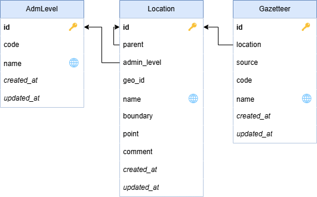
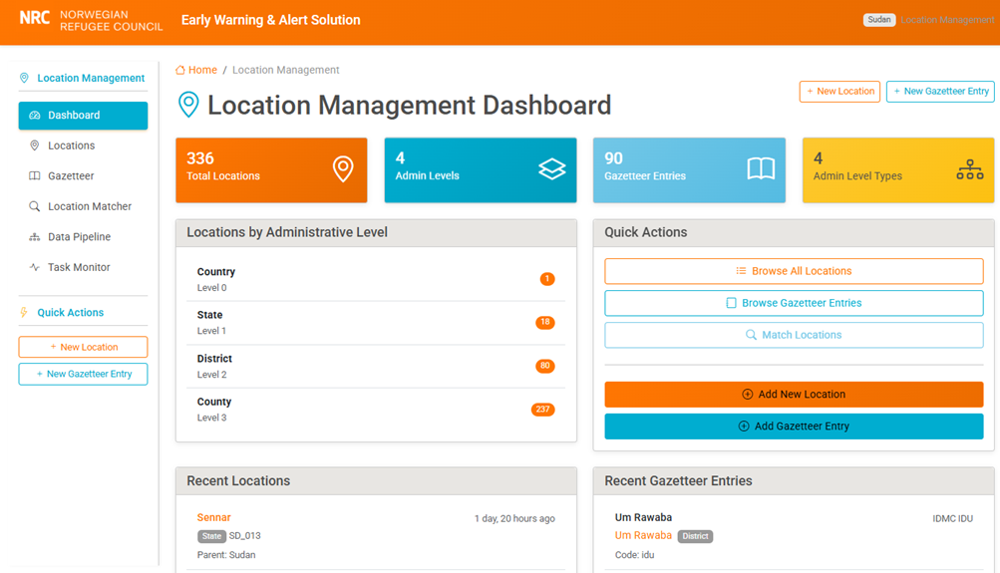
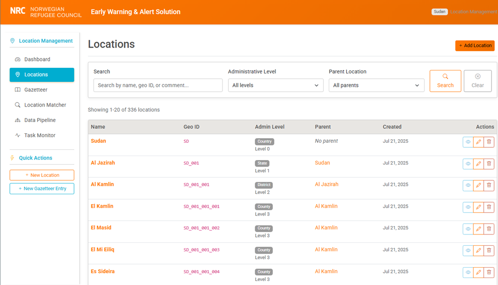
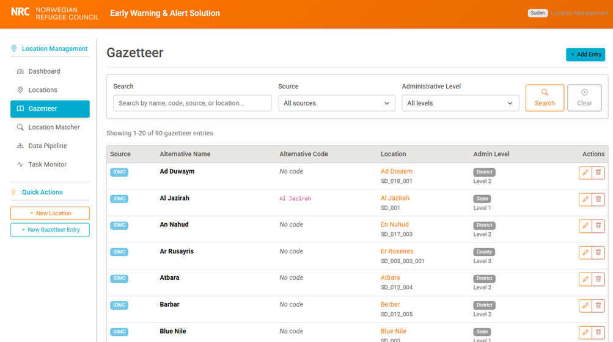
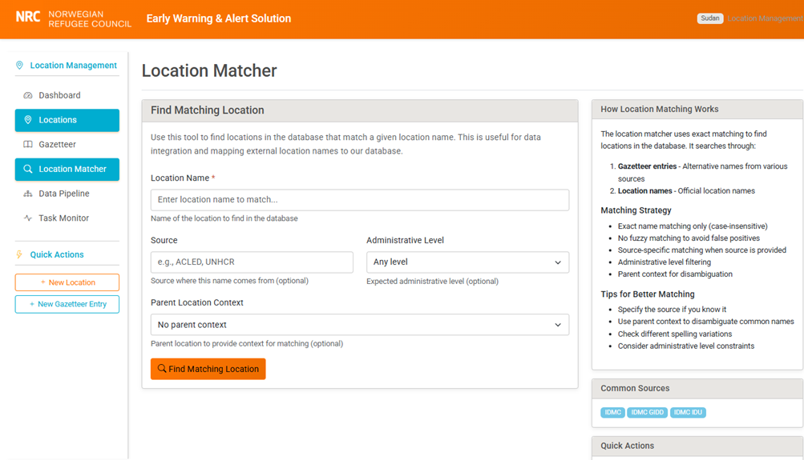

## 8. Location framework

### 8.1 Key concepts

The **location system** provides geographic data management that goes beyond simple name matching. The hierarchical location system models real-world administrative divisions, supporting country-to-local hierarchies that can accommodate different administrative structures across different regions.

The **gazetteer** system maintains multiple name variations for each location, including official names, common names, historical names, and alternative spellings. This approach recognizes that different data sources often use different names for the same geographic entity, and the system needs to resolve these variations to enable proper data integration.

**Geographic boundary** support through PostGIS enables spatial analysis capabilities including point-in-polygon queries, distance calculations, and spatial aggregation. This spatial functionality is essential for mapping applications (e.g. dashboard).

**Location matching** resolves textual location names to standardized geographic entities based on a gazetteer – a table of alternative names. The system uses exact name matching  (with or without hierarchical context), and code matching. No fuzzy matching is implemented, as experience proves that it can lead to too many false positives, in particular when location names are transliterated (as is the case in Sudan). In the case a location is unknown, the system will halt the processing and return an error. Manual matching will need to be entered into the gazetteer, and the processing can then resume. Since sources will use consistent geographic reference systems, this is expected to represent a limited manual workload, essentially at the time of integrating a new source.

### 8.2 Architecture
### 8.3 Data model

<figure>
<figcaption>Location data model</figcaption>

</figure>

### 8.4 Implementation
### 8.5 API endpoints

| **Endpoint** | **Purpose** |
| --- | --- |
| **/location/api/locations/** | List locations with filtering and pagination |
| **/location/api/admin-levels/** | List administrative level definitions |
| **/location/api/match/** | Match location names to database entries |
| **/location/api/locations/{id}/hierarchy/** | Get location hierarchy and children |

### 8.6 Web interface

The web interface to the location management app allows to add / remove / edit locations and gazetteer entries, and to test location matching.

<figure>
<figcaption>Location management app - dashboard</figcaption>

</figure>

<figure>
<figcaption>Location management app – Locations list</figcaption>

</figure>

<figure>
<figcaption>Location management app – Gazetteer</figcaption>

</figure>

<figure>
<figcaption>Location management app – Location matching</figcaption>

</figure>
