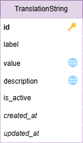

## 9. Translation system

### 9.1 Key concepts
### 9.2 Architecture
### 9.3 Data model

<figure>
<figcaption>Translation data model</figcaption>

</figure>

### 9.4 Implementation
### 9.5 API endpoints
### 9.6 Web interface
